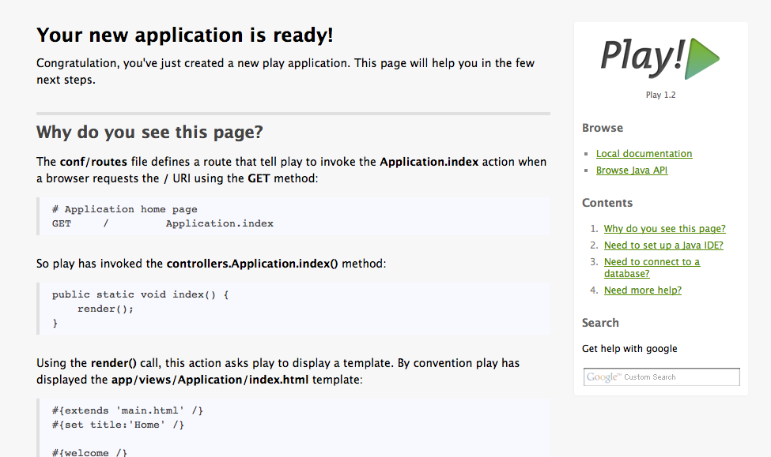
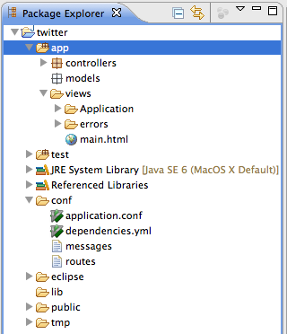
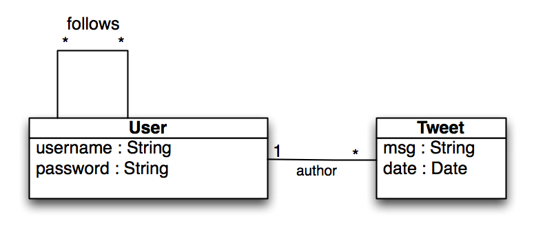
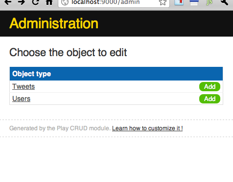
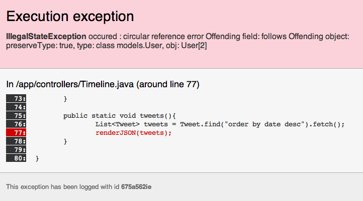

# Playing with Play
---

#Autor

* nombre: Axel Hernández Ferrera
* email : [axelhzf@gmail.com](mailto:axelhzf@gmail.com)
* blog : [http://axelhzf.tumblr.com](http://axelhzf.tumblr.com)
* twitter: [axelhzf](http://twitter.com/axelhzf)

---

## Playframework

* [Web oficial](http://www.playframework.org/)
* [github](https://github.com/playframework/play)
* [google group](http://groups.google.com/group/play-framework)

# Características
* Java puro o [Scala](http://scala.playframework.org/)
* Hot deploy
* Full stack: Hibernate, memcached, [sistema de módulos](http://www.playframework.org/modules)
* Compilación automática y errores en el navegador
* Stateless model
* Integración con WebSockets
* Sistema de plantillas basado en groovy

---

## Play

¿Aplicación de tareas en 10 minutos?

<iframe src="http://player.vimeo.com/video/7087610?title=0&amp;byline=0&amp;portrait=0&amp;color=ffffff" width="400" height="225" frameborder="0"></iframe>

En el taller conseguiremos hacer...

---

## Objetivo del taller

Crear Twitter

---

## Instalación de play

Descargar la última versión desde

[http://www.playframework.org/download](http://www.playframework.org/download)

Descomprimir en una carpeta y añadir la ruta al PATH

---

## Creando el proyecto
    
Comados para crear un proyecto nuevo

	play new twitter
	cd twitter
	play run
    

Abrir [http://localhost:9000/](http://localhost:9000/)

  
---

## Configuración con Eclipse

Play viene preparado para integrarse con varios [IDEs](http://www.playframework.org/documentation/1.2.2/ide). En el taller utilizaremos Eclipse.

Genera los archivos de configuración de Eclpse:

	play eclipsify

Importar el proyecto en eclipse:

File/Import/General/Existing project

---

## Estructura del proyecto

Estructura de una aplicación play

---

## Primera página

Creamos el primer controlador

controller/Application.java

	public static void index() {
		String msg = "HOLA TLP!";
		render(msg);
	}

views/Application/index.html

	#{extends 'main.html' /}
	#{set title:'Home' /}
	<h2>${msg}</h2>

conf/routes

	GET / Application.index		  

[http://localhost:9000/](http://localhost:9000/)

---

# Modelo de datos

---

# Clase User

	package models;
	
	import java.util.ArrayList;
	import java.util.List;
	import javax.persistence.Entity;
	import javax.persistence.ManyToMany;
	import play.db.jpa.Model;
	
	@Entity
	public class User extends Model {
		
		public String username;
		
		public String password;
		
		@ManyToMany
		public List<User> follows;
	
		public User(String username, String password) {
			super();
			this.username = username;
			this.password = password;
			follows = new ArrayList<User>();
		}
	}

---
	
# Clase Tweet

	package models;
	
	import java.util.Date;
	import javax.persistence.Entity;
	import javax.persistence.ManyToOne;
	import play.db.jpa.Model;
	
	@Entity
	public class Tweet extends Model {
	
		public String msg;
	
		@ManyToOne
		public User author;
		
		public Date date;
		
		public Tweet(String msg, User author){
			this.msg = msg;
			this.author = author;
			date = new Date();
		}
		
	}
	
---

# ¿¿¿ PERO ESTO QUÉ ES ???
* ¿Cómo que public? Debería declarar los campos privados y crear los getters y los setters
* ¿Dónde están los DAOs? ¿Dónde están los servicios?
* ¿Por qué extiendes de la clase Model?

---

# Modificaciones de bytecode
Vamos a crear un test para demostrarlo

	import models.User;
	import org.junit.Assert;
	import org.junit.Test;
	import play.test.UnitTest;
	
	public class ByteCode extends UnitTest {
		@Test
		public void getter(){
			User user = new User("tlp", "secret");
			System.out.println(user.username);
			Assert.assertEquals("tlp", user.username);
		}	
	}
	
Bastante simple, debería funcionar.

	18:14:12,284 INFO  ~ Starting /Volumes/Datos/Proyectos/play/tlp/twitter/.
	18:14:13,085 WARN  ~ You're running Play! in DEV mode
	18:14:14,386 INFO  ~ Connected to jdbc:h2:mem:play;MODE=MYSQL;LOCK_MODE=0
	18:14:15,140 INFO  ~ Application 'twitter' is now started !
	tlp
	
---

# Modificaciones de bytecode

Si ahora añadimos el getter a la clase User

	public String getUsername(){
		return "llamada al getter";
	}
		
Al volver a ejecutar el test ahora falla.

	18:17:15,030 INFO  ~ Starting /Volumes/Datos/Proyectos/play/tlp/twitter/.
	18:17:15,780 WARN  ~ You're running Play! in DEV mode
	18:17:17,035 INFO  ~ Connected to jdbc:h2:mem:play;MODE=MYSQL;LOCK_MODE=0
	18:17:17,814 INFO  ~ Application 'twitter' is now started !
	llamada al getter
	
## Ahora se está llamando a getUsername() aunque no hayamos puesto una llamada explicita.

\* No te olvides de borrar el método getUsername(), era sólo una prueba

---

## ¿Y los DAOs?

Al extender de la clase Model, play añade los métodos básicos de CRUD.
Creamos un nuevo test para probarlo.

	import models.User;
	import org.junit.Assert;
	import org.junit.Test;
	
	import play.db.jpa.GenericModel.JPAQuery;
	import play.test.UnitTest;
	public class ModelTest extends UnitTest {
	
		@Test
		public void user(){		
			User user1 = new User("user1", "secretPassword1234");
			user1.save();
			
			User user2 = new User("user2", "ultraSecretPassword");
			user2.save();
		
			long numeroUsuario = User.count();
			Assert.assertEquals(2, numeroUsuario);
			
			User findUser1 = User.find("byUsername", "user1").first();
			Assert.assertNotNull(findUser1);
			Assert.assertEquals("secretPassword1234", findUser1.password);
		}
	}
	
---
	
# Datos para los test en YAML

Play incorpora una clase de utilidad que permite cargar datos en la base de datos desde ficheros escritos en YAML.

**\*IMPORTANTE:** Al escribir el yaml cuidado con los tabuladores, se utilizan espacios para separar

test/data.yml

	User(user1):
	   username: user1
	   password: user1
	
	User(user2):
	   username: user2
	   password: user2
	
	Tweet(tweet1):
	    msg: "Este es el primer tweet"
	    author : user1
	
	Tweet(tweet2):
	    msg: "Segundo tweet"
	    author : user2

---

# Datos para los test en YAML

Para cargar los datos se utiliza la clase Fixtures.

	public class ModelTest extends UnitTest {
	
		@Before
		public void setup(){
			Fixtures.deleteAllModels();
			Fixtures.loadModels("data.yml");
		}
		
		@Test
		public void user(){
			long numeroUsuario = User.count();
			Assert.assertEquals(2, numeroUsuario);
			
			User findUser1 = User.find("byUsername", "user1").first();
			Assert.assertNotNull(findUser1);
			Assert.assertEquals("secretPassword1234", findUser1.password);
		}
	}

---

# Espera... y la base de datos?

Cuando ejecutamos los test nos aparecía la siguiente línea que indica que estamos utilizando una base de datos en memoria.
	
	Connected to jdbc:h2:mem:play;MODE=MYSQL;LOCK_MODE=0

En el fichero de configuración conf/application.conf podemos específicar qué base de datos queremos utilizar.
	
	#Es la configuración utilizada en los test
	%test.db.url=jdbc:h2:mem:play;MODE=MYSQL;LOCK_MODE=0
	
	#Descomentar esta opción para utilizar la base de datos
	db=mem 

Play trae integrado un administrador de base de datos. 

[http://localhost:9000/@db](http://localhost:9000/@db)

* Controlador: org.h2.Driver
* URL: jdbc:h2:mem:play
* Nombre de usuario: sa
* Contraseña: 	

---

# Creando el Timeline (Datos iniciales)

Copia el fichero initial-data.yml en la carpeta conf/

[Descarga fichero](files/initial-data.yml)

Crea la clase Bootstrap que se ejecutará cada vez que inicies la aplicación y cargará los datos desde el fichero initial-data.yml

app/app/Bootstrap.java

	package app;
	
	import models.User;
	import play.jobs.Job;
	import play.jobs.OnApplicationStart;
	import play.test.Fixtures;
	
	@OnApplicationStart
	public class Bootstrap extends Job {
	
		public void doJob(){
			if(User.count() == 0){
				Fixtures.loadModels("initial-data.yml");
			}
		}
		
	}

---

# Creando el Timeline (Controlador)

Listando todos los tweets.
Primera aproximación listando todos los tweets de la base de datos.

app/controller/Timeline.java

	public class Timeline extends Controller {
	
		public static void index(){
			List<Tweet> tweets = Tweet.find("order by date desc").fetch();
			render(tweets);
		}
		
	}

conf/routes

	GET     /    Timeline.index

---

# Creando el Timeline (Vista)

app/views/Timeline/index.html

	#{extends 'main.html' /}
	#{set title:'timeline' /}
	
	<h2>Timeline</h2>
	
	#{if tweets.size() == 0}
		
No hay ningún tweet que mostrar

	#{/if}
	#{else}
		#{list items:tweets, as:'tweet'}	
			

				
${tweet.author.username}

				
${tweet.msg}

				
${tweet.date}

			

		#{/list}
	#{/else}

---
	
# Creando el Timeline (Tag)

Los tags permiten reutilizar código en las visitas.
Los tags se pueden parametrizar.
Dentro del tag, los argumentos se reciben con _nombreDelParametro. El parámetro por defecto es _arg

app/views/tags/tweet.html
	
	

		
${_arg.author.username}

		
${_arg.msg}

		
${_arg.date}

	

app/views/Timeline/index.html
	
	...
	
	#{list items:tweets, as:'tweet'}	
		#{tweet tweet /}	
	#{/list}
	
	...	

---

# Módulos

Play tiene un sistema muy completo de módulos.
Un módulo es más que una librería, puede añadir controladores, rutas, recursos.
Puedes crearte tus propios módulos.

En esta dirección puedes consultar los módulos disponibles.

[http://www.playframework.org/modules](http://www.playframework.org/modules)

En el taller aprenderemos utilizarmos los módulos:

* [Secure](http://www.playframework.org/documentation/1.2.2/secure)
* [CRUD](http://www.playframework.org/documentation/1.2.2/crud)

---	

# Módulo Secure (Instalación)
	
[Documentación del módulo](http://www.playframework.org/documentation/1.2.2/secure)	

Instalación:

Añadir dependencia a conf/dependencies.yml
	
	require:
    	- play -> secure

Ejecutar

	play dependencies
	play eclipsify
 
 
F5 en el proyecto de eclipse

Añadir rutas por defecto a conf/routes
	
	*      /                module:secure

**Reiniciar el servidor**

---

# Módulo Secure (Uso)

Uso: 	

	package controllers;
	...
	
	@With(Secure.class)
	public class Timeline extends Controller {
	 ...
	}
	
Personalizar mecanismo de seguridad

controllers/Security.java

	package controllers;
	import models.User;
	public class Security extends Secure.Security {
		static boolean authenticate(String username, String password) {
	        User user = User.find("byUsername", username).first();
	        return user != null && user.password.equals(password);
	    }
	    
	    static User userConnected(){
			User user = User.find("byUsername", session.get("username")).first();
			return user;
		}   
	}

---
	
# Módulo CRUD (Instalación)

[Documentación del módulo](http://www.playframework.org/documentation/1.2.2/crud)	

Instalación:

Añadir dependencia a conf/dependencies.yml
	
	require:
    	- play -> crud

Ejecutar

	play dependencies
	play eclipsify
 
 
F5 en el proyecto de eclipse

Añadir rutas por defecto a conf/routes
	
	*      /admin           module:crud

---
	
# Módulo CRUD (Uso)

Crear los siguientes controladores

controllers/Tweets.java

	package controllers;
	import play.mvc.With;
	@With(Secure.class)
	public class Tweets extends CRUD {	
	}	
	
controllers/User.java

	package controllers;
	import play.mvc.With;
	@With(Secure.class)
	public class Users extends CRUD {
	}

Entrar en [http://localhost:9000/admin](http://localhost:9000/admin)	

---

# Módulo CRUD (Uso)

---
	
# Añadiendo estilo

Copia estos archivos en las rutas indicadas para personalizar el aspecto de la página

- [public/images/logo.png](files/logo.png)
- [public/stylesheets/main.css](files/main.css)
- [app/views/main.html](files/main.html)

---

# Enviando tweets

views/Timeline/index.html

	

	#{form @Timeline.addTweet(), id:"tweet-form"}
		<label>What's happening</label>
		<textarea name="tweet.msg" id="tweet-msg"> </textarea>
		

			<input type="submit" value="Tweet" id="tweet-submit">
		

	#{/form}
	

	
controller/Timeline.java

	public static void addTweet(Tweet tweet){
		tweet.author = Security.userConnected();
		tweet.date = new Date();
		tweet.save();
		
		index(); //redirige de nuevo al timeline
	}

conf/routes

	POST    /addTweet                      Timeline.addTweet
	
---

# Validación

models/Tweet.java

	@MaxLength(140)
	@Required
	public String msg;
	
controllers/Timeline.java

	public static void addTweet(@Valid Tweet tweet) {
		if (validation.hasErrors()) {
			params.flash();
			validation.keep();
		} else {
			tweet.author = Security.userConnected();
			tweet.date = new Date();
			tweet.save();
		}
		index();
	}
	
---

# Mostrando errores de validación

view/Timeline/index.html

	#{ifErrors}
	<ul class="errors">
	#{errors}
	    <li>${error}</li>
	#{/errors}
	</ul>
	#{/ifErrors}	

---
	
# Un poco de AJAX

Añadimos un nuevo método en Timeline.java

	public static void tweets(){
		List<Tweet> tweets = Tweet.find("order by date desc").fetch();
		renderJSON(tweets);
	}

renderJSON - Renderiza un objeto en formato JSON

Añadimos la ruta

	GET     /api/tweets                              Timeline.tweets
	
Accedemos a la página

[http://localhost:9000/tweetList](http://localhost:9000/tweetList)	

---

# Ooops Circular Reference

---

# El problema con renderJSON

El problema y la solución está ampliamente explicado en este [post](http://www.lunatech-research.com/archives/2011/04/20/play-framework-better-json-serialization-flexjson).

En resumen:

* El método renderJSON utiliza la librería [GSON](http://code.google.com/p/google-gson/) para transformar el objeto a JSON. Esta librería hace una serialización en profundidad.
* En nuestro caso, las referencias a los followeres de un usuario, provocan un error de referencia circular.
* Además utilizando la librería se envían todos los campos, por ejemplo se estaría enviando las contraseñas.

Soluciones:

* Crear un objeto intermedio que contenga únicamente la información que se debe enviar
* Utilizar la librería [flexjson](http://flexjson.sourceforge.net/) que nos permite especificar qué campos queremos serializar. Esta será la opción que utilizaremos.

---

# Añadiendo una nueva dependencia

conf/dependencies.yml

	require:
	    - play
	    - play -> secure
	    - play -> crud
	    - net.sf.flexjson -> flexjson 2.1

y ejecutar

	play dependencies
	
Con esto play se descargará la librería desde el repositorio central de maven.	

Por último actualizamos la configuración de eclipse

	play eclipsify

---

# Filtrando los campos

	public static void tweets(){
	    List<Tweet> tweets = Tweet.find("order by date desc").fetch();
	    renderJSON(new JSONSerializer().include("msg", "date", "author.username").exclude("*").serialize(tweets));
	}

---

# Cambios en la vista

views/Timeline/index.html

	

	<form  id="tweet-form">
		<label>What's happening</label>
		<textarea id="tweet-msg" name="tweet.msg"> </textarea>
		

			<input type="submit" value="Tweet" id="tweet-submit">
		

	</form>
	
	
	

		
---

# Añadiendo javascript

view/Timeline/timeline.html

	
	
---

# Añadiendo funcionalidades

Por ahora esto no es twitter sino un sitio donde los usuarios pueden dejar sus mensajes.

Objetivos:

* Poder consultar los tweets de otro usuario
* Limitar los tweets del timeline a los propios y a los de personas que sigue
* Mostrar información de followers
* Añadir botón follow y unfollow

---

# Consultar tweets de otro usuario

controller.Timeline

	public static void tweets(String user){
		List<Object> tweets = Tweet.find("select tweet from Tweet tweet where tweet.author.username = ? order by tweet.date desc", user).fetch();
		renderJSON(new JSONSerializer().include("msg", "date", "author.username").exclude("*").serialize(tweets));
	}

conf/routes
	
	GET     /{user}                        Timeline.index
	GET     /api/tweets/{user}             Timeline.tweets

---

# Timeline

controller.Timeline

	public static void timeline(){
		List<Object> tweets = Tweet.find("select tweet from Tweet tweet, User user where user = ? and (tweet.author = user or tweet.author member of user.follows) order by tweet.date desc", Security.userConnected()).fetch();
		renderJSON(new JSONSerializer().include("msg", "date", "author.username").exclude("*").serialize(tweets));
	}

conf/routes

	GET     /api/timeline                  Timeline.timeline

---

# Función cargar tweets

			

---

#Mostrar información de followers

controller.Timeline

	public static void index(String user) {
		User usuarioConsultado = null;
		User usuarioConectado = Security.userConnected();
		
		if(user != null) {
			usuarioConsultado = User.find("byUsername", user).first();
		}else {
			usuarioConsultado = Security.userConnected();
		}
		
		//Información
		long followings = User.count("select count(follow) from User user join user.follows follow where user = ?", usuarioConsultado);
		long followers = User.count("select count(user) from User user where ? member of user.follows", usuarioConsultado);
				
		render(user, usuarioConectado, usuarioConsultado, followings, followers);
	}
	
views/Timeline/index.html

	

		<ul>
			<li>Follower: ${followers}</li>
			<li>Following: ${followings}</li>
		</ul>
	

	
---

# Añadir botón follow y unfollow

controller/Timeline.java

	public static void follow(String user){
		User usuarioConectado = Security.userConnected();
		User usuarioConsultado = User.find("byUsername", user).first();
		
		usuarioConectado.follows.add(usuarioConsultado);
		usuarioConectado.save();
		
		index(null);
	}
	
	public static void unfollow(String user){
		User usuarioConectado = Security.userConnected();
		User usuarioConsultado = User.find("byUsername", user).first();
		
		usuarioConectado.follows.remove(usuarioConsultado);
		usuarioConectado.save();
		
		index(null);
	}	

conf/routes

	POST    /follow                        Timeline.follow
	POST    /unfollow                      Timeline.unfollow

---

# Añadir botón follow y unfollow
	
views/Timeline/index.html

	#{if usuarioConectado != usuarioConsultado}
	

		#{if usuarioConectado.follows.contains(usuarioConsultado)}
			#{form @Timeline.unfollow()}
				<input type="hidden" name="user" value="${usuarioConsultado.username}">
				<input type="submit" value="Unfollow!"/>
			#{/form}
		#{/if}
		#{else}
			#{form @Timeline.follow()}
				<input type="hidden" name="user" value="${usuarioConsultado.username}">
				<input type="submit" value="Follow!"/>
			#{/form}
		#{/else}
	

	#{/if}

---

# Gracias

Contacto:

* nombre: Axel Hernández Ferrera
* email : [axelhzf@gmail.com](mailto:axelhzf@gmail.com)
* blog : [http://axelhzf.tumblr.com](http://axelhzf.tumblr.com)
* twitter: [axelhzf](http://twitter.com/axelhzf)

	